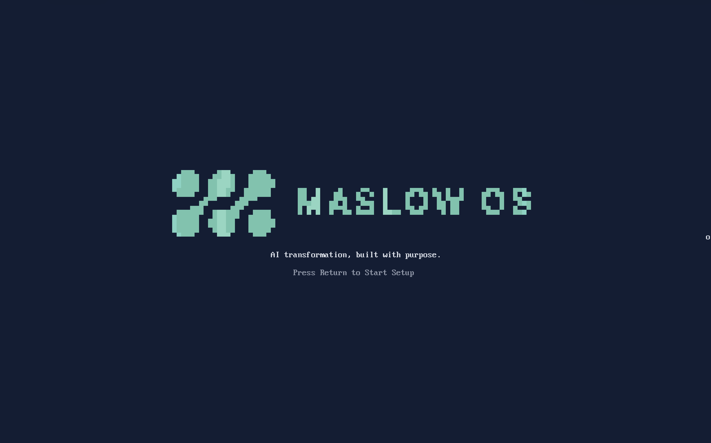
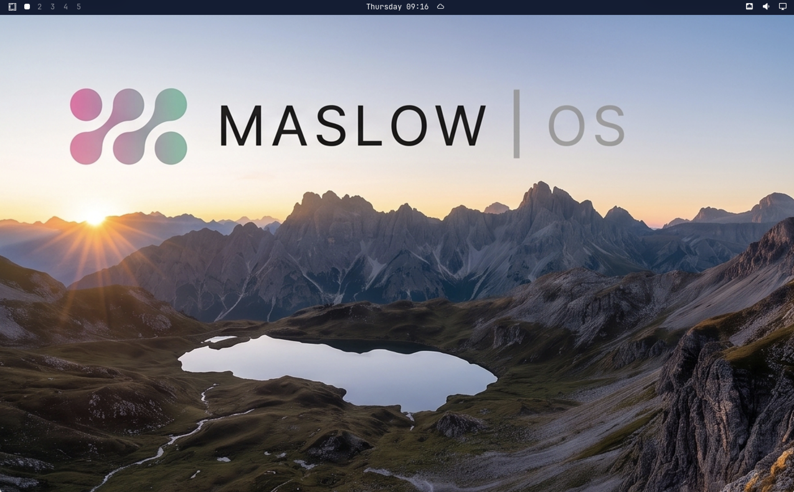

# Maslow OS

Maslow OS is an opinionated Linux environment for AI builders and operators. It combines a focused desktop, practical developer tooling, and a coherent Maslow interface so teams can move from an AI roadmap to working systems without losing clarity or control.

Maslow OS is based on [Omarchy](https://omarchy.org/) and [Arch Linux](https://archlinux.org/). The Omarchy command line, configuration paths, package names, and extension contracts remain intact for compatibility.

> **Preview status:** `0.1.0-preview.1`. The current Apple Silicon image is a development preview, not a supported public ARM release. The first supported installer target is x86_64.

## Experience preview

These screenshots show the current Maslow OS preview experience. Visual details may evolve before the first public release.

### Start of setup



### Desktop



## Install on a Mac with UTM

There is no public Maslow OS binary installer yet. The source is public, but the current x86_64 ISO is a local-build preview and the Apple Silicon VM is an internal development artifact. Do not redistribute either preview as a Maslow OS release. Published installers will appear on the [Maslow OS releases page](https://github.com/letsgomaslow/maslow-os/releases) only after the release gates below are complete.

### 1. Identify your Mac chip

Open **Apple menu > About This Mac**, or run:

```bash
uname -m
```

- `x86_64` means an Intel Mac.
- `arm64` means an Apple Silicon Mac (M1, M2, M3, M4, or later).

[UTM virtualization requires the guest architecture to match the Mac](https://docs.getutm.app/settings-qemu/system/). A matching guest can use hardware virtualization; a different architecture falls back to slower CPU emulation and is not a supported Maslow OS configuration.

### Compatibility matrix

| Mac host | Guest architecture | UTM mode | Maslow OS status | Recommended path |
| --- | --- | --- | --- | --- |
| Intel Mac | x86_64 | Virtualize | First supported installer target; currently local-build preview only | Build or obtain a verified x86_64 preview ISO and follow the Intel instructions below |
| Apple Silicon | aarch64 / ARM64 | Virtualize | Internal development preview only | Contributors may import an authorized `.utm` preview; everyone else should wait for the ARM64 installer |
| Apple Silicon | x86_64 | Emulate | Unsupported and substantially slower | Do not use for installation, performance testing, or release validation |
| Intel Mac | aarch64 / ARM64 | Emulate | Unsupported | Do not use for installation or release validation |
| Intel or Apple Silicon | Bare metal | Not a VM | Not supported by the current Maslow OS milestone | Keep macOS installed and use UTM |

### 2. Prepare UTM

1. Install the current version of [UTM for Mac](https://mac.getutm.app/).
2. Obtain an artifact that matches your Mac's architecture. Do not treat an unofficial Omarchy or community VM image as a Maslow OS release.
3. Start with 4 virtual CPUs, 8–16 GB of memory, and a 64 GB virtual disk. These are development starting points, not published minimum requirements; leave enough memory and storage for macOS.
4. Use shared networking unless your environment requires a different network model.
5. Keep an untouched copy of the installer or powered-off preview before performing major upgrades.

Maslow OS has no shared or published default password. Create your own user and password during first-run setup. Do not reuse credentials embedded in a downloaded VM or rely on an unknown Keychain entry.

### 3A. Intel Mac: install the x86_64 ISO

The x86_64 preview ISO must currently be built on an x86_64 Linux host with Docker. Follow the [Maslow OS ISO build instructions](https://github.com/letsgomaslow/maslow-os-iso); the ISO builder does not run natively on macOS.

After obtaining and verifying the ISO:

1. Open UTM and select **Create a New Virtual Machine**.
2. Choose **Virtualize**, then **Linux**.
3. Attach the Maslow OS x86_64 ISO as the boot image and keep UEFI boot enabled.
4. Assign the CPU, memory, virtual disk, display, and shared networking settings described above.
5. Start the VM and install to the UTM virtual disk. Confirm the selected disk carefully—the installer may erase the selected target, but it must never be pointed at a passed-through physical Mac disk.
6. Complete the setup screens and create your own account, password, hostname, keyboard layout, and timezone.
7. After installation, shut down the guest, eject the ISO from the VM, and place the virtual disk first in the boot order.
8. Start the VM again and confirm that the Maslow OS login screen and desktop load.

### 3B. Apple Silicon: run the ARM64 development preview

There is no public or supported Apple Silicon installer today. If you are a Maslow contributor with an authorized ARM64 `.utm` preview:

1. Keep the original archive as a recovery copy.
2. Extract the archive and open the `.utm` bundle with UTM. Use UTM's duplication workflow when creating another copy so it receives its own VM identity and network address.
3. Confirm that the guest architecture is **aarch64 / ARM64** and that hardware virtualization is enabled.
4. Start the VM and complete first-run setup yourself, including the account and password.
5. Update only after keeping a powered-off recovery copy. The preview uses the compatible Omarchy update engine, but ARM64 remains outside the supported public release boundary.

Do not attach the x86_64 ISO to an Apple Silicon VM and call the result supported. UTM can emulate x86_64, but its documentation describes cross-architecture emulation as slower and not guaranteed to behave like native virtualization.

### 4. Run and maintain the VM

- Start the VM from UTM and sign in with the account you created.
- Press **Command + Option** to release captured keyboard and pointer input.
- Use the desktop update action or run `omarchy-update` inside the guest. Omarchy command names remain unchanged for compatibility.
- Shut down from inside Maslow OS before closing or moving the VM. Use UTM's force-stop control only when recovery is intended, because it can lose guest data.
- UTM shared folders vary by virtualization backend. Follow the official [UTM Linux guest sharing guide](https://docs.getutm.app/guest-support/linux/) rather than assuming a host folder is mounted automatically.

## Architecture compatibility roadmap

This roadmap is gate-based rather than date-based. A working developer image is not considered a supported release.

| Milestone | Architecture and platform | Current state | Required release gates |
| --- | --- | --- | --- |
| Development preview | Apple Silicon host with a native aarch64 UTM guest | Working internally; unsupported and not redistributable | Reproducible source setup, branded first run, update testing, and documented recovery |
| First public installer | x86_64 UEFI for Intel Macs and PC virtual machines | Next supported target | Maslow-owned signing keys and repository, checksums, clean encrypted and unencrypted installs, update and rollback validation |
| Generic ARM64 | aarch64 UEFI for Ampere, AWS Graviton, Snapdragon X, and ARM virtual machines | Planned; dependent on upstream installer and repository work | Published aarch64 package mirror, ARM64 ISO, bootloader and encryption validation, native CI, QEMU and hardware acceptance tests |
| Apple Silicon VM release | Native aarch64 guest in UTM on M-series Macs | Planned after the generic ARM64 installer | Repeatable installer/import, graphics, input, clipboard, shared-folder, suspend, login, update, and recovery validation across representative M-series hosts |
| Intel Mac bare metal | x86_64 Intel Macs, including representative T1/T2 models | Evaluation only | Model matrix for boot, keyboard, audio, Wi-Fi, graphics, suspend, encryption, and macOS recovery |
| Apple Silicon bare metal | M-series Macs through an Asahi-based platform | Research only; no release commitment | Hardware-driver maturity, safe installer and recovery design, external-display coverage, encryption, updates, and rollback |
| Additional architectures | RISC-V and board-specific ARM systems | Backlog | User demand, upstream distribution maturity, maintainable boot flow, package coverage, CI hardware, and support ownership |

The upstream [generic aarch64 ISO plan](https://github.com/omacom/omarchy-iso/blob/quattro/plans/aarch64-support.md) currently targets generic UEFI ARM64 systems and explicitly excludes Apple Silicon bare metal and board-specific boot stacks. Maslow OS will not claim those platforms until its own installation and update gates pass.

## Product branches

- `quattro` is a clean, fast-forward-only mirror of upstream Omarchy.
- `maslow` is the downstream integration branch.
- `main` is the default public product branch.
- Upstream updates flow from `quattro` into `maslow`, then into `main` through reviewed pull requests. Public product history is never rebased or force-pushed.

The maintained downstream patch inventory and sync procedure live in [`DOWNSTREAM.md`](DOWNSTREAM.md).

## Maslow themes

Maslow OS includes two first-party themes:

- `maslow-dark` — the installation default, built on Maslow dark navy.
- `maslow-light` — an accessible light companion using Maslow's approved text accents.

Both themes generate native Omarchy configurations for Hyprland, the shell, terminals, browsers, btop, Neovim, Helix, VS Code, Obsidian, and related applications. The **Reduced Motion** toggle disables Hyprland animation and applies theme backgrounds without a transition.

## Documentation

The inherited Omarchy manual remains the authoritative reference for engine behavior and the compatible `omarchy` commands. Maslow-specific branding, release, and downstream maintenance guidance lives in this repository.

- [Getting Started](manual/02-getting-started.md)
- [Omarchy CLI compatibility](manual/14-omarchy-cli.md)
- [Themes](manual/06-themes.md)
- [Branding](manual/41-branding.md)
- [Making a theme](manual/43-making-your-own-theme.md)

## Verification

Run brand and source checks inside Linux with Bash 5:

```bash
./test/maslow-brand
./test/cli
./test/shell
./test/all
```

Graphical acceptance tests must run in a disposable VM through the sibling ISO repository. See [`agents/skills/acceptance-tests.md`](agents/skills/acceptance-tests.md).

## License and attribution

The software remains available under the upstream [MIT License](LICENSE). See [`NOTICE`](NOTICE) for upstream attribution and the separate treatment of Maslow names, logos, and brand assets.
